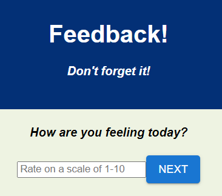
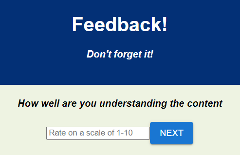
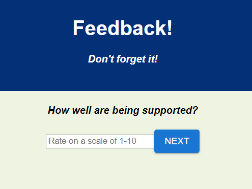
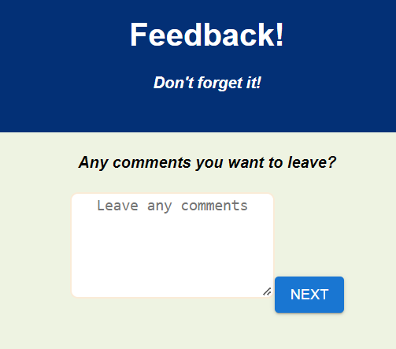
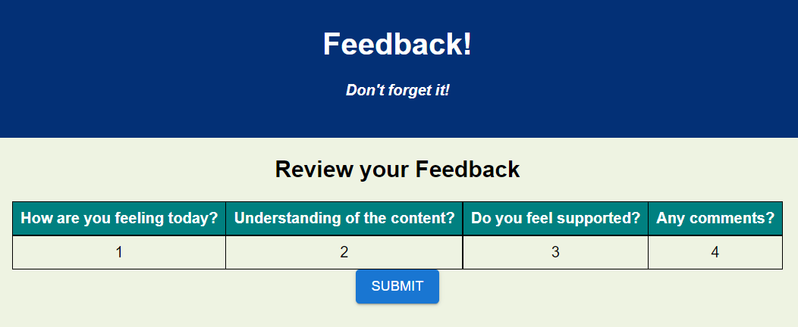
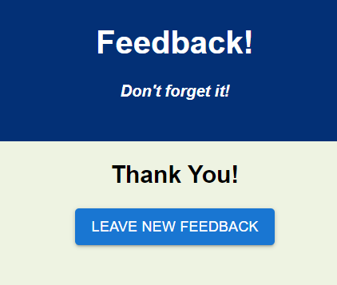

    

# weekend-redux-feedback-loop

## Table of Contents

- [Description](#description)
- [Screenshots](#screenshots)
- [Built With](#built-with)
- [Getting Started](#getting-started)
  - [Prerequisites](#prerequisites)
  - [Installation](#installation)
- [Usage](#usage)
- [License](#license)
- [Acknowledgements](#acknowledgements)
- [Contacts](#contacts)

## Description

For this project I created a feedback form to share how you are feeling and how well you are understanding information. There is also a comment box to leave more details and a table displaying your answers.

## Screenshots

## Built With

## Getting Started

1. Set up your sql database using the queries in the 'data.sql' file.
2. Make sure to 'npm install'. Then run the command, 'npm run client' and 'npm run server' in your code editor's terminal.

### Prerequisites

What do I need to install before I can run your project

### Installation

npm install.

## Usage

1.Enter how you are feeling on a scale of 1-10 and click the 'Next' button. 2. .Enter how you feel you understand the information on a scale of 1-10 and click the 'Next' button.
3.Enter how well you are being supported on a scale of 1-10 and click the 'Next' button. 4. Enter any additional comments and click the next button. 5. You can review your information and then click submit, which sends your information off to the database. 6. Here you can start a new feedback.

## License

<a href="https://choosealicense.com/licenses/mit/">MIT License</a>

## Acknowledgements

Thanks to Prime Digital Academy who equipped and helped me to make this application a reality. Thanks to my instructor, Liz. Also, my undying thanks and gratitude to my classmates in the Jemisin cohort for their generosity and support.

## Contacts

 
